# HealthCare-Pharmacy

This project in development mode

</b>HealthCare Pharmacy is an online medicine ordering and delivery platform.</b>

<h1><b>Screenshots </h1></b>

                                            
 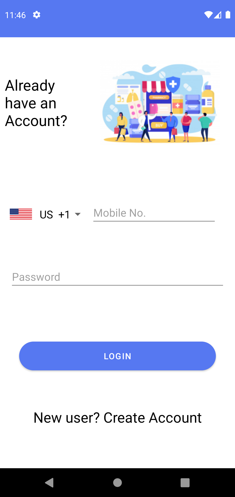   
 
 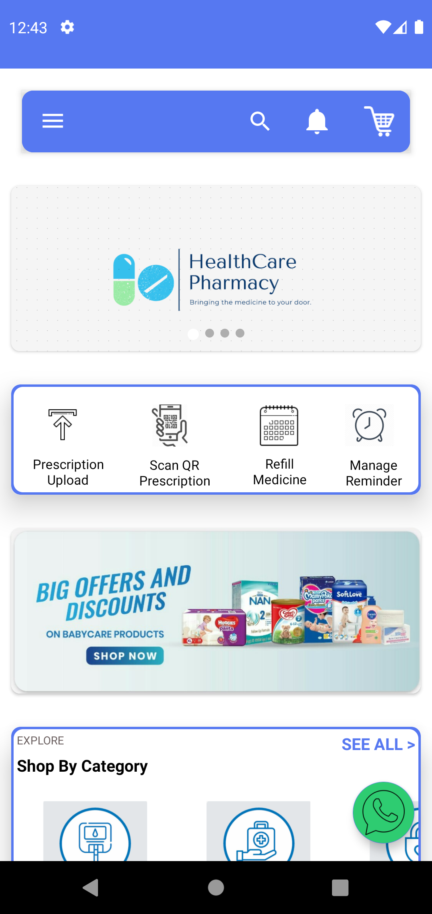   
  
 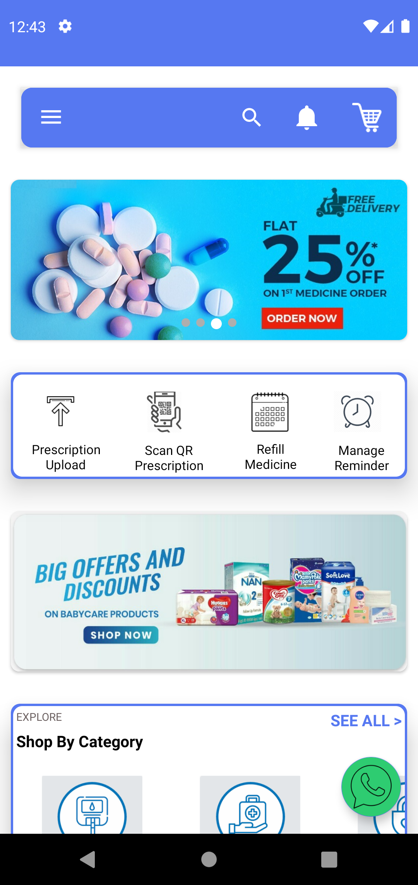
  
  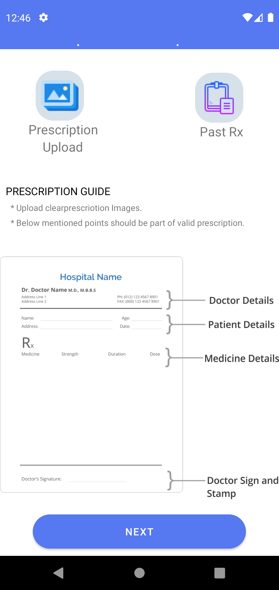
  
  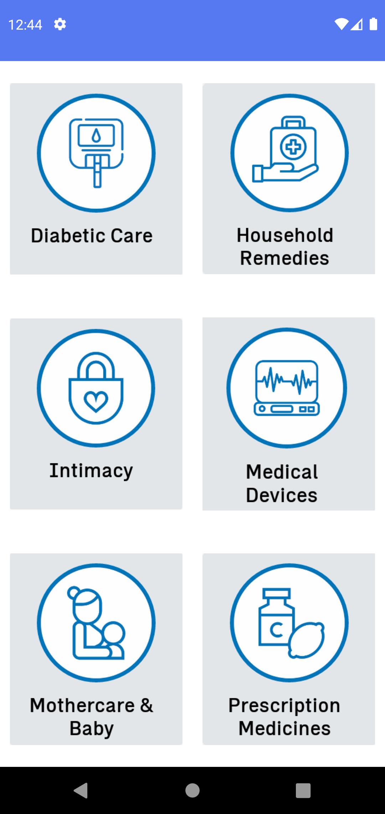
   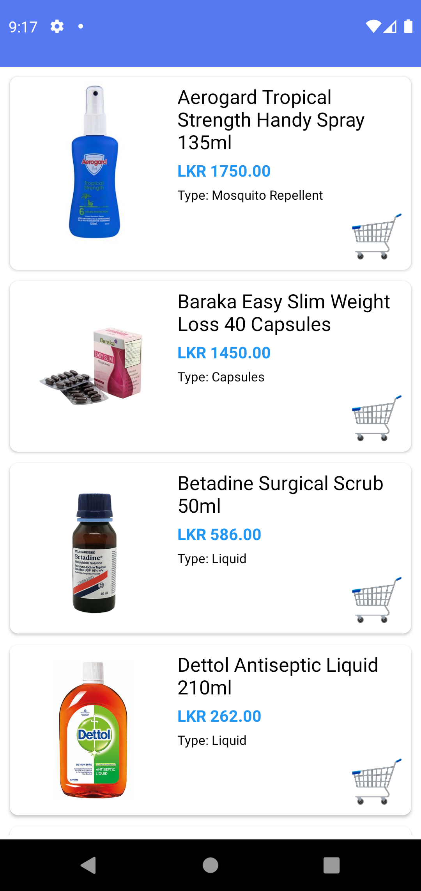
   
   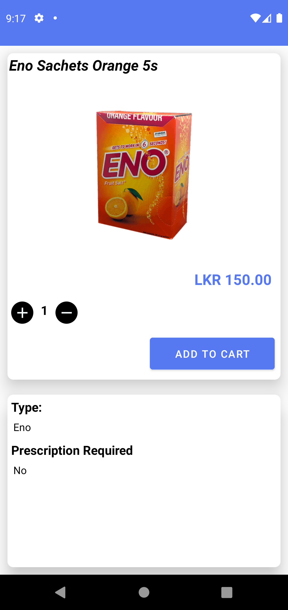
    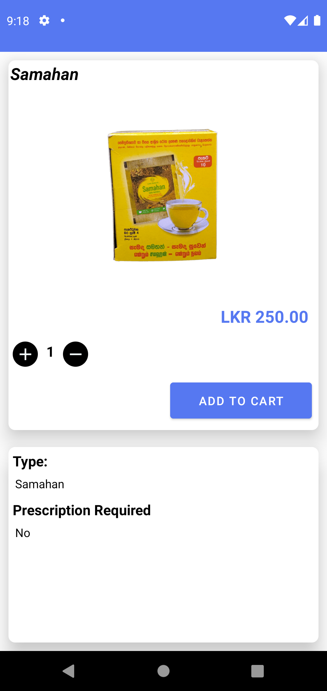
    
   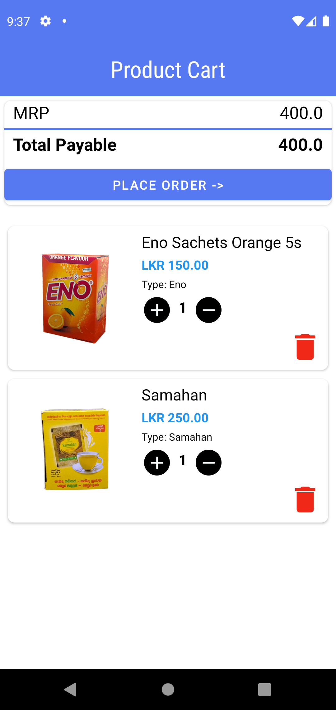
    
   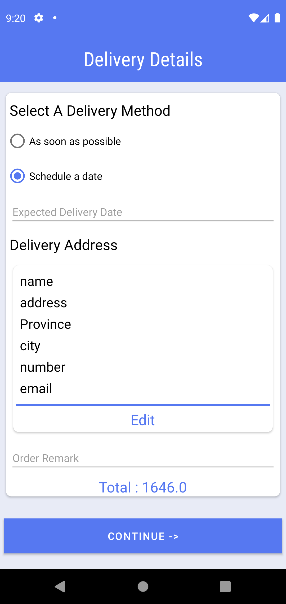
   
  
  
   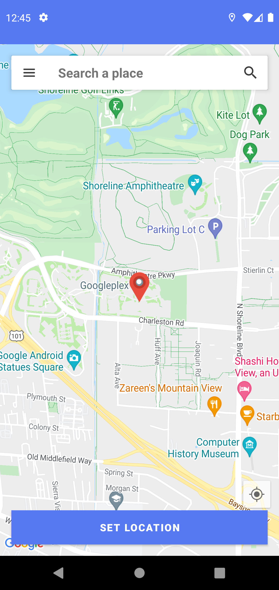
   
   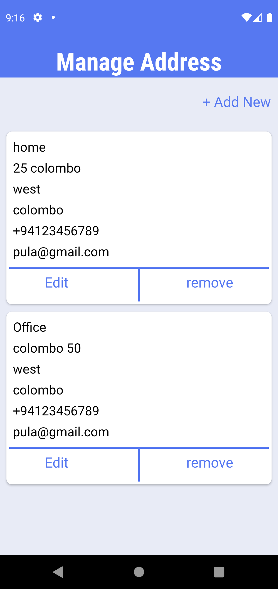
  
   
 

------------ note ------------------ 

remove this server from sri lanka 

remove related items floder 

get Storage backup 

remove google.json file 

<string name="google_maps_api">put your api key</string>

